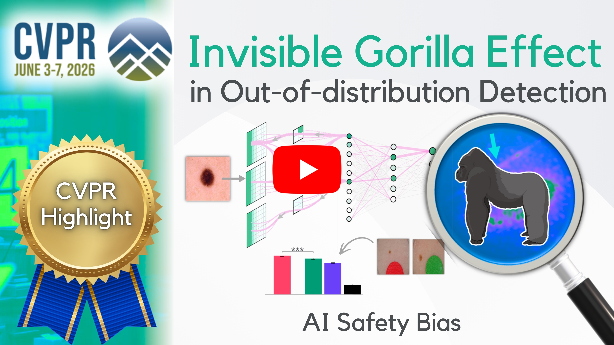
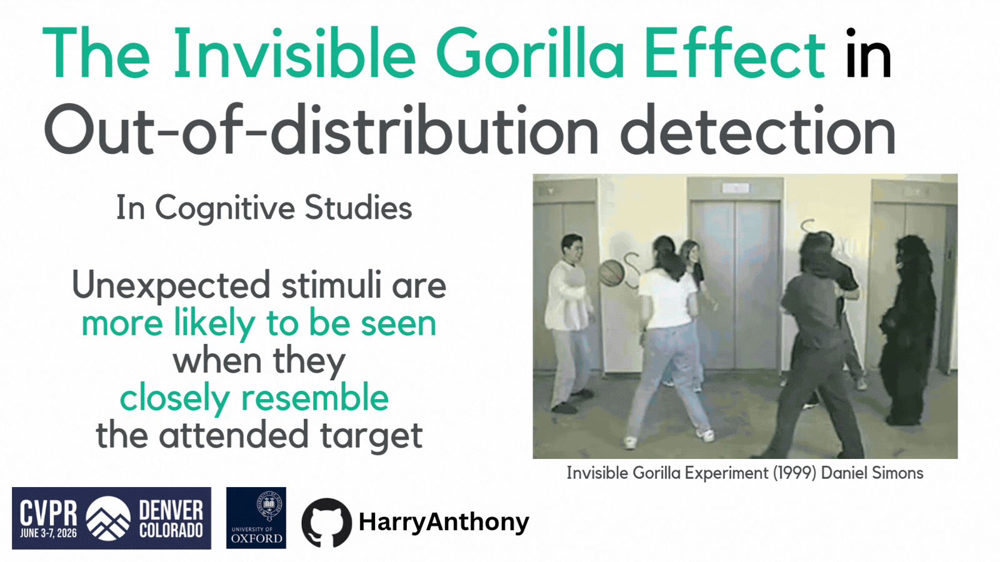
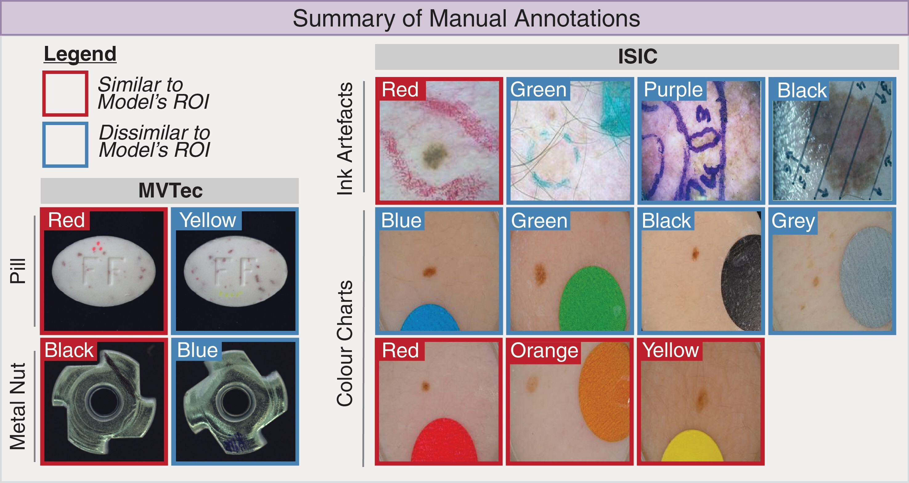
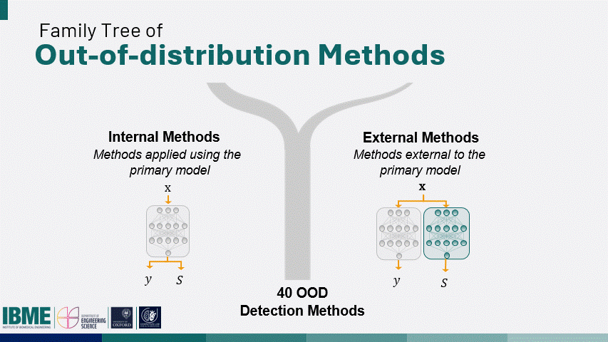
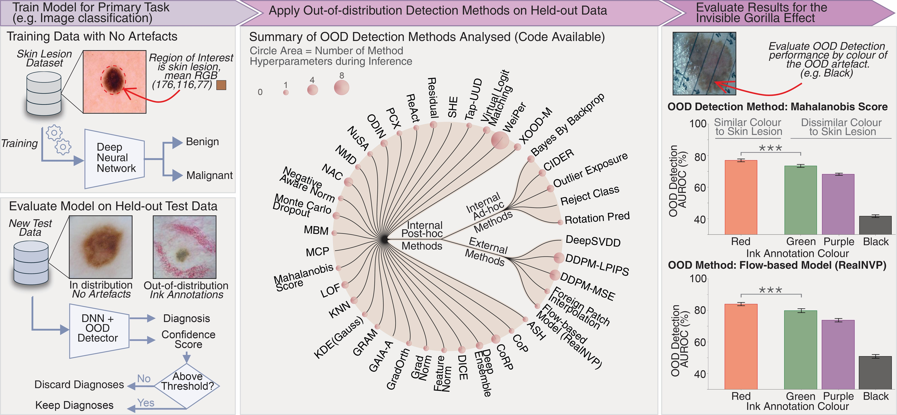

# OOD Detection Evaluation Framework

<p align="center">
  <a href="https://arxiv.org/abs/2602.20068"></a>
  <a href="https://www.harryanthony.org/docs/CVPR_conference_poster_Harry_Anthony_2026.pdf"></a>
  <a href="https://www.youtube.com/watch?v=DkVL_twut9M"></a>
  <a href="https://medium.com/@harry.anthony/the-invisible-gorilla-effect-a-hidden-bias-in-ai-safety-checks-f2acee2abfb8"></a>
</p>

<p align="center">
  
</p>

This repository contains code and data which corresponds to the paper [[1]](#ref-1). The work studies a bias in **out-of-distribution (OOD) detection**, known as the **Invisible Gorilla Effect**, where OOD detection performance improves when OOD artefacts are visually similar to the model's region of interest. This is a research codebase for training image classifiers and benchmarking out-of-distribution detection methods on medical and industrial imaging datasets. The pipeline covers model training, flexible dataset/OOD splits and evaluating OOD detection methods. This work was accepted as a **Highlight at CVPR 2026**. If these ideas, code or dataset helped influence your research, please cite the following paper (bibtex given at bottom of readme).

<a id="ref-1"></a>

**[1]** [Harry Anthony, Ziyun Liang, Hermione Warr, Konstantinos Kamnitsas; Proceedings of the IEEE/CVF Conference on Computer Vision and Pattern Recognition (CVPR), 2026, pp. 39314-39325](https://openaccess.thecvf.com/content/CVPR2026/html/Anthony_The_Invisible_Gorilla_Effect_in_Out-of-distribution_Detection_CVPR_2026_paper.html)

<p align="center">
    <a href="https://www.youtube.com/watch?v=DkVL_twut9M" target="_blank">
        
    </a>
</p>
<p align="center"><i>Watch my presentation of this project.</i></p>

### Features of codebase:

- **Multi-dataset support** with per-dataset configuration for public datasets: [CheXpert](data/CheXpert/README.md), [ISIC](data/ISIC/README.md) and [MVTec-AD](data/MVTec/README.md)
- **Configurable ID/OOD splits** using pre-made settings (e.g. `setting1` / `setting2` / `setting3`) or custom class, demographic and dataset-specific filters
- **Broad OOD method catalog**: supports 40 different OOD detections, including post-hoc methods (e.g. MCP, ODIN, Mahalanobis, ReAct, ViM), ad-hoc methods (e.g. BNN, RotPred, CIDER) and external methods (e.g. DDPM, DeepSVDD, RealNVP)
- **Multiple OOD evaluation modes**: different class, different dataset or synthetic artefacts (square, triangle, polygon, ring, text, Gaussian noise/blur, invert)
- **Manually annotated data**: annotations for real artefacts in [ISIC](data/ISIC) and [MVTec-AD](data/MVTec). 
- **Experiment tracking** via `outputs/saved_models/model_list.csv` (model metadata keyed by seed)
- **Results evaluation** (macro/micro metrics, per-image scores, plots)


### :newspaper: Updates

19 May 2026:
* The repository is now live!


<p align="center">
  
</p>

## Table of Contents

- [1. Repository structure](#1-repository-structure)
- [2. Requirements & Installation](#2-requirements--installation)
  - [2a. Prerequisites](#2a-prerequisites)
  - [2b. Tech stack](#2b-tech-stack)
  - [2c. Environment setup](#2c-environment-setup)
  - [2d. Dataset Installation](#2d-dataset-installation)
- [3. Usage Instructions](#3-usage-instructions)
  - [3a. Train a classifier](#3a-train-a-classifier)
  - [3b. Evaluate an OOD detection method](#3b-evaluate-an-ood-detection-method)
  - [3c. Using Manual Annotations](#3c-using-manual-annotations)
    - [3ci. ISIC](#3ci-isic)
    - [3cii. MVTec-AD](#3cii-mvtec-ad)
    - [3ciii. CheXpert](#3ciii-chexpert)
- [4. Examples](#4-examples)
  - [CheXpert: train then evaluate with Mahalanobis distance](#chexpert-train-then-evaluate-with-mahalanobis-distance)
  - [Deep ensemble (multiple seeds)](#deep-ensemble-multiple-seeds)
  - [ISIC with cross-dataset OOD](#isic-with-cross-dataset-ood)
- [5. Technical Background](#5-technical-background)
  - [5a. OOD Detection Methods](#5a-ood-detection-methods)
  - [5b. The Invisible Gorilla Effect](#5b-the-invisible-gorilla-effect)
- [6. Troubleshooting](#6-troubleshooting)
- [7. Contributing](#7-contributing)
- [8. Citation](#8-citation)
- [9. License](#9-license)


## 1. Repository structure

```
.
├── LICENSE                          # MIT License (original project code)
├── requirements.txt                 # Python dependencies
├── requirements-pytorch.txt         # PyTorch + torchvision (CUDA) install pin
├── training.py                      # Train a classifier, register model in model_list.csv
├── evaluate_OOD_detection_method.py  # Run OOD detection evaluation on a trained model
├── make_synthetic_artefacts.py      # Synthetic OOD transform utilities
├── source/
│   ├── config/                      # Dataset configs (chexpert, ISIC, MVTec)
│   ├── dataloaders/                 # Dataset classes and selection helpers
│   ├── models/                      # Network definitions (e.g. Wide ResNet)
│   ├── post_hoc_methods/            # Post-hoc OOD detection methods (confidence and feature-based)
│   ├── ad_hoc_methods/              # Methods requiring custom training/heads (BNN, RotPred, CIDER, …)
│   ├── external_methods/            # Methods external to primary model (DDPM, DeepSVDD, RealNVP, …)
│   └── util/                        # CLI args, training, evaluation, data processing
├── data/
│   ├── CheXpert/                    
│   ├── ISIC/
│   └── MVTec/
└── outputs/
    ├── saved_models/                # Checkpoints + model_list.csv
    └── experiment_outputs/        # OOD evaluation results
```


## 2. Requirements & Installation


### 2a. Prerequisites

- **Python 3** (version not pinned in the repo; use a version compatible with your PyTorch build)
- **CUDA-capable GPU** recommended (multi-GPU supported via `DataParallel` when `--cuda_device all`)
- **Dataset files** downloaded separately (not included). See dataset READMEs under `data/`.


### 2b. Tech stack

| Component | Libraries / tools |
|-----------|-------------------|
| Deep learning | [PyTorch](https://pytorch.org/) |
| Data & ML | NumPy, pandas, scikit-learn |
| Imaging | scikit-image, Pillow, torchvision transforms |
| Plotting & I/O | matplotlib, scipy, imageio, einops |
| Multilabel splits | `iterstrat` (`iterative-stratification`) |
| Optional logging | Weights & Biases (`--wandb_args`) |

Dependency lists are in `requirements-pytorch.txt` (GPU stack) and `requirements.txt` (everything else). See [Environment setup](#2c-environment-setup) for details.


### 2c. Environment setup

Experiments were implemented using **PyTorch 2.6.0** with **CUDA 12.4** and **cuDNN 9.1.0**. Use an NVIDIA driver compatible with CUDA 12.4.

```bash
# 1. Create and activate a virtual environment (recommended)
python -m venv .venv
source .venv/bin/activate

# 2. PyTorch + torchvision (CUDA 12.4 wheels)
pip install -r requirements-pytorch.txt \
  --index-url https://download.pytorch.org/whl/cu124

# 3. Remaining Python packages
pip install -r requirements.txt
```

For CPU-only development (not used in the paper setup), install `torch` / `torchvision` from [pytorch.org](https://pytorch.org/get-started/locally/) without the `cu124` index.

**What each dependency is for**

| Package | PyPI name | Used for |
|---------|-----------|----------|
| `torch`, `torchvision` | torch, torchvision | Models, dataloaders, transforms, feature extraction |
| `numpy`, `pandas` | numpy, pandas | Arrays, CSV metadata, experiment registry |
| `sklearn` | scikit-learn | Metrics, splits, KNN/LOF/KDE, PowerTransformer, GMM |
| `scipy` | scipy | `entropy`, `ndimage.gaussian_filter` |
| `matplotlib` | matplotlib | Plots, font lookup for synthetic text artefacts |
| `PIL` | Pillow | Image I/O in dataloaders |
| `libauc` | libauc | **Always imported** in `get_criterion()` / `get_optimiser_scheduler()` (AUCM loss, PESG optimiser) |
| `iterstrat` | iterative-stratification | Multilabel train/val/test splits (`Select_dataset.py`) |
| `einops` | einops | DDPM visualisation |
| `imageio` | imageio | DDPM |
| `skimage` | scikit-image | Synthetic OOD masks (`make_synthetic_artefacts.py`) |
| `tqdm` | tqdm | Optional progress bars (declared in bundled CRP package metadata) |

**Optional (not in `requirements.txt` by default):**

| Package | When needed |
|---------|-------------|
| Bundled `zennit` + `crp` | `--method PCX` — vendored under `source/post_hoc_methods/post_hoc_utils/` (no separate pip install) |
| `wandb` | Only if you include Weights & Biases into `training_dict['wandb_dict']` |

Run all commands below from the repository root.

### 2d. Dataset Installation

| Dataset | Config module | Expected paths (from config) |
|---------|---------------|------------------------------|
| `chexpert` | `source/config/chexpert.py` | `data/CheXpert/CheXpert-v1.0-small/` (images + CSVs), `data/CheXpert/` for loader root |
| `ISIC` | `source/config/ISIC.py` | `data/ISIC/` with `train.csv`, `valid.csv` (and optionally `test.csv`) |
| `MVTec` | `source/config/MVTec.py` | `data/MVTec/` with `train.csv`, `valid.csv` |

Download instructions:

- CheXpert: [CheXpert-v1.0-small](https://stanfordmlgroup.github.io/competitions/chexpert/) → `data/CheXpert/`
- ISIC: [ISIC Archive](https://challenge.isic-archive.com/data/) → `data/ISIC/`
- MVTec-AD: [MVTec AD](https://www.mvtec.com/company/research/datasets/mvtec-ad) → `data/MVTec/`

Each dataset defines **preset experiment settings** (`setting1`, `setting2`, …) in its config file under `dataset_selection_settings` and `OOD_selection_settings`. These control which classes are in-distribution vs OOD, demographic filters, and train/val/test splitting (including k-fold).


## 3. Usage Instructions

### 3a. Train a classifier

Example (CheXpert, setting 1, ResNet-18):

```bash
python training.py \
  --dataset chexpert \
  --setting setting1 \
  --net_type ResNet18 \
  --seed 0 \
  --batch_size 32 \
  --save_path outputs/saved_models
```

Supported `--dataset` values in `get_dataset_config()`: `chexpert`, `ISIC`, `MVTec`.

Supported `--net_type` values include: `wide-resnet`, `ResNet18`, `ResNet34`, `ResNet50`, `efficientnet`, `vgg11`, `vgg16`, `vgg16_bn`, `vit_b_16`, `vit_b_32`, `vit_l_16`, `swin_t`.

Checkpoints are written under `outputs/saved_models/<dataset>/`. Training runs for `num_epochs` defined in the dataset config.

**Resume training:**

```bash
python training.py --dataset chexpert --setting setting1 --resume_training True --seed <existing_seed>
```

**Model registry:**

Trained models are recorded in `outputs/saved_models/model_list.csv`. OOD evaluation loads a model by **`--seed`**, which must match a row in that file. Train a model before evaluating, or add a row manually if you import external checkpoints.

**Command-line interface help:**

| Task | Command |
|------|---------|
| Train | `python training.py [args]` |
| Evaluate OOD | `python evaluate_OOD_detection_method.py [args]` |
| CLI help | `python training.py --help` or `python evaluate_OOD_detection_method.py --help` |

Shared arguments are defined in `source/util/common_args.py` (`create_parser()`).


### 3b. Evaluate an OOD detection method

Example (MCP baseline, OOD = different class per setting, return metrics):

```bash
python evaluate_OOD_detection_method.py \
  --seed 0 \
  --method MCP \
  --ood_type different_class \
  --setting setting1 \
  --batch_size 32 \
  --return_metrics True
```

**OOD types** (`--ood_type`): `different_class`, `different_dataset`, `synthetic` or a list combining them (e.g. `['different_class','synthetic']`).

**Cross-dataset OOD** (`--ood_type` includes `different_dataset`): `--ood_dataset` must be `chexpert` or `ISIC` (see `get_ood_dataset()` in `source/util/processing_data_utils.py`).

**Synthetic OOD** example:

```bash
python evaluate_OOD_detection_method.py \
  --seed 0 \
  --method MCP \
  --ood_type synthetic \
  --synth_artefact square \
  --synth_scale "(0.1,0.1)" \
  --return_metrics True
```

Synthetic artefact options: `square`, `triangle`, `polygon`, `ring`, `text`, `Gaussian_noise`, `Gaussian_blur`, `invert` (see `make_synthetic_artefacts.py`).

**Save results** to `outputs/experiment_outputs/` (default `--save_results_path`):

```bash
python evaluate_OOD_detection_method.py \
  --seed 0 \
  --method mahalanobis \
  --ood_type different_class \
  --save_results True \
  --filename my_run
```

### 3c. Using Manual Annotations

A contribution is the work is the development of new OOD detection benchmarks, which we are making public to be used to evaluate and improve current OOD detection methods. These annotations are utilised using the pre-defined settings in the `source/config` directory.  We hope they will be useful for assessment of OOD methods in future works by the community. Please cite this work if you use this data in your research.


<p align="center">
  
</p>
<p align="center"><i>Visualisation of manual annotations of artefacts by colour.</i></p>


##### 3ci. ISIC
The ISIC annotations can be found in the `data/ISIC/annotations` directory:

* `Training data`: Annotated images with no coloured artefacts (e.g. rulers, ink markings, colour charts), to prevent biases and shortcut learning being introduced during training which would have added compounds. We use 5-fold splits for model training data and held-out ID data for OOD detection evaluations.

* `Ink_annotations`: Annotated images with ink artefacts. These were separated into separate colours: black, green, purple and red.

* `Colour_chart`: Annotated images with colour charts. These were separated into separate colours: black, blue, green, orange, red, yellow and white/grey. There is an additional directory called `below_10p_coverage` which includes images where the colour chart artefacts cover less than 10% of the images pixels, as larger artefacts can yeild uniformly high AUROC across all colour.

##### 3cii. MVTec-AD
The MVTec-AD annotations can be found in the `data/MVTec` directory:

* `Metal_nut`: Annotated images with ink artefacts. These were separated into separate colours: black and blue.

* `Pill`: Annotated images with ink artefacts. These were separated into separate colours: red and yellow.

##### 3ciii. CheXpert
The CheXpert annotations can be found in the `data/CheXpert` directory:

* `no_support_devices`: Annotated images with no support devices (lines, PICC, tube, valve, catheter, hardware, arthroplast, plate, screw, cannula, coil, mediport, pacemakers) visibly obscuring the chest. These annotations are from our previous [research paper](https://github.com/HarryAnthony/Mahalanobis-OOD-detection).


**DISCLAIMER:** These annotations were made by author Harry Anthony (PhD candidate in Engineering Science) based on visual inspection, and were **not validated by medical experts**. This data is for **research purposes only**.


## 4. Examples

### CheXpert: train then evaluate with Mahalanobis distance

```bash
# Train
python training.py --dataset chexpert --setting setting1 --net_type wide-resnet --depth 28 --widen_factor 10 --seed 42

# Evaluate (requires training activations)
python evaluate_OOD_detection_method.py \
  --seed 42 \
  --method mahalanobis \
  --ood_type different_class \
  --setting setting1 \
  --mahalanobis_module -1 \
  --return_metrics True
```

### Deep ensemble (multiple seeds)

```bash
python evaluate_OOD_detection_method.py \
  --seed 0 \
  --method deepensemble \
  --deep_ensemble_seed_list "[0,1,2]" \
  --ood_type different_class \
  --return_metrics True
```

### ISIC with cross-dataset OOD

```bash
python evaluate_OOD_detection_method.py \
  --seed 0 \
  --method MCP \
  --ood_type different_dataset \
  --ood_dataset chexpert \
  --return_metrics True
```

*(Requires a model trained on ISIC registered under `--seed 0` in `model_list.csv`.)*


## 5. Technical Background

### 5a. OOD Detection Methods


The methods evaluated were catagorised into 4 groups: External methods, Internal ad-hoc methods, Confidence-based methods (Internal post-hoc) and Feature-based methods (Internal post-hoc).


<p align="center">
  
</p>
<p align="center"><i>Visualisation of the taxonomy of OOD detection methods.</i></p>


Methods registered in `evaluate_ood_detection_method()` (`source/util/evaluate_network_utils.py`):

| Key | Category |
|-----|----------|
| `ASH`, `deepensemble`, `DICE`, `GAIA`, `gradnorm`, `GradOrth`, `MCP`,  `MCDP`, `ODIN`, `ReAct`, `SHE`, `ViM`,  `WeiPer` | Confidence-based Methods  |
| `COP`, `CORP`, `FeatureNorm`, `GRAM`, `KDE`, `KNN`,  `LOF`, `mahalanobis`, `MBM`, `negative_aware_norm`, `NAC`, `NMD`, `NuSA`,  `PCX`, `Residual`, `TAPUUD`, `XOOD-M` | Feature-based Methods  |
| `BNN`, `CIDER`, `RotPred`, `Reject_class` | Ad-hoc Methods |
| `DeepSVDD`, `ddpm`, `Norm_flow`, `FPI`| External Methods |

Some methods like outlier exposure do not have a separate method for evaluation, but use existing approaches `MCP` to evaluate the Ad-hoc method. Many methods require **training data** at evaluation time (e.g. Mahalanobis, ReAct, KNN). The script loads ID train loaders automatically when `--method` is in the internal `methods_need_training_data` list.

Method-specific hyperparameters are controlled as CLI flags in `common_args.py` (e.g. `--temperature` for ODIN, `--n_neighbours` for KNN, `--ReAct_percentile` for ReAct). A full list of all the evaluated hyperparameters evaluated in the paper are listed in the [Supplementary Material](https://arxiv.org/abs/2602.20068). 


### 5b. The Invisible Gorilla Effect

<p align="center">
  
</p>
<p align="center"><i>Visualisation of the Invisible Gorilla Effect, from paper [[1]](#ref-1).</i></p>

The repository was used to study a bias in out-of-distribution detection methods, known as the Invisible Gorilla Effect, where OOD detection methods peform better at detecting OOD artefacts that are visually similar to the model's region of interest. The name of this effect references the famous [Invisible Gorilla Experiment](https://www.theinvisiblegorilla.com), in which participants asked to count basketball passes between players in white shirts - while ignoring passes between players in black shirts - often failed to notice a person in the gorilla costume in the walking through the video. This research was recently accepted as a Highlight at **CVPR 2026**, one of the largest conferences in AI research. In the paper [[1]](#ref-1), we investigate how the Invisible Gorilla Effect impacts a wide range of out-of-distribution detection methods, explore why the phenomenon occurs and discuss how future AI safety tools could be designed to be more robust.


## 6. Troubleshooting

| Issue | Notes |
|-------|--------|
| `Database configuration unknown` | Use `--dataset chexpert`, `ISIC`, or `MVTec` (default: `chexpert` with `--setting setting1`). |
| `Experiment seed is not in the list of known experiments` | Train with that `--seed` first, or ensure `outputs/saved_models/model_list.csv` contains the seed. |
| Missing CSVs under `data/` | Split-based datasets need `train.csv` / `valid.csv`. |
| CUDA OOM | Reduce `--batch_size` or set `--cuda_device` to a single GPU index. |

## 7. Contributing

Suggested practices when extending the code:

- Add new OOD methods under `source/post_hoc_methods/` (or `ad_hoc_methods` / `external_methods`) and register them in `evaluate_ood_detection_method()` in `source/util/evaluate_network_utils.py`.
- Add dataset settings in the corresponding file under `source/config/`.
- Keep experiment metadata consistent with `model_list.csv` columns used in `record_model()`.


## 8. Citation

I hope this work is useful for further understanding how neural networks behave when encountering an OOD input. If you found this work useful or have any comments, do let me know. Please email me your feedback or any issues to: harry.anthony@eng.ox.ac.uk.

When citing this research, please use the bibTex:

```
@InProceedings{Anthony_2026_CVPR,
    author    = {Anthony, Harry and Liang, Ziyun and Warr, Hermione and Kamnitsas, Konstantinos},
    title     = {The Invisible Gorilla Effect in Out-of-distribution Detection},
    booktitle = {Proceedings of the IEEE/CVF Conference on Computer Vision and Pattern Recognition (CVPR)},
    month     = {June},
    year      = {2026},
    pages     = {39314-39325}
}
```

### 9. License

This repository is licensed under the **MIT License**. See [`LICENSE`](LICENSE).

Bundled third-party code (CRP, zennit, bayesian-torch) is **not** covered by that
MIT license and remains under its original terms. See [`THIRD_PARTY_NOTICES.md`](THIRD_PARTY_NOTICES.md)
for paths, upstream sources, and license files.

